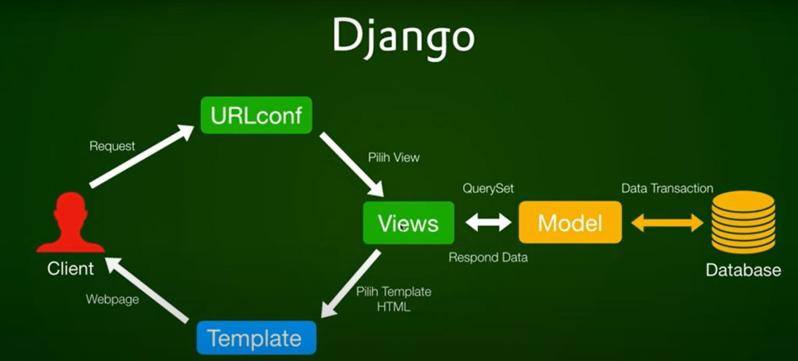
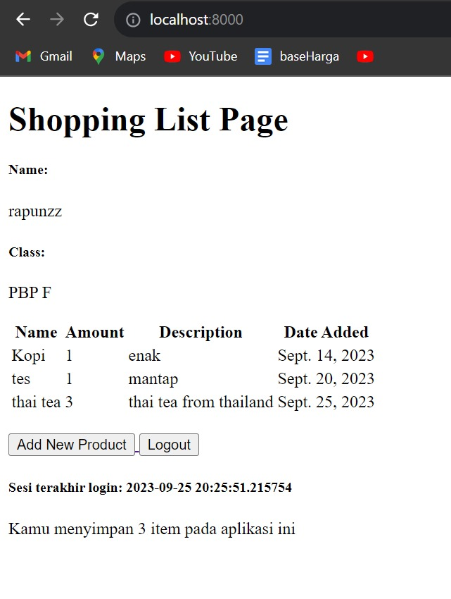
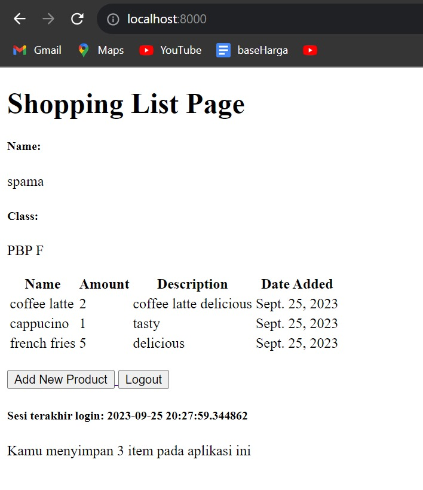
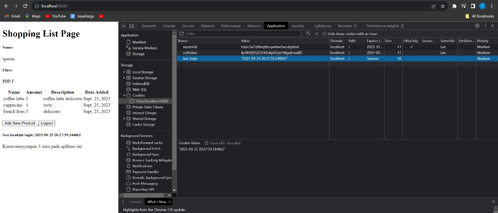

### Thaariq Kurnia Spama - 2206082801 - PBP F


## 1. Jelaskan bagaimana cara kamu mengimplementasikan checklist di atas secara step-by-step (bukan hanya sekadar mengikuti tutorial).
### Membuat sebuah proyek Django baru.
Langkah pertama yang saya lakukan adalah membuat direktori baru dengan nama yang diinginkan seperti "inventory_list" kemudian membuat command prompt di dalam direktori tersebut, kemudian membuat virtual environment dan mengaktifkannya. Langkah kedua membuat berkas requirements.txt pada direktori yang sama pada sebelumnya dan ditambahkan dependenciesnya. Kemudian pasang dependencies dan buat proyek Django dengan nama yang diinginkan sebelumnya seperti "inventory_list" dengan perintah ``` django-admin startproject inventory_list . ```  . Jangan lupa untuk menambahkan "*" pada ALLOWED_HOSTS di settings.py untuk keperluan deployment dan unggah proyek ke repository github. Dengan begini sebuah proyek Django baru telah berhasil dibuat.
### Membuat aplikasi dengan nama main pada proyek tersebut.
Untuk Membuat aplikasi dengan nama main, langkah yang diperlukan yang pertama yaitu menjalankan perintah "python manage.py startapp main" pada proyek inventory_list untuk membuat aplikasi baru. Kemudian mendaftarkan aplikasi main ke dalam proyek dengan urutannya yaitu membuka berkas settings.py di dalam direktori proyek shopping_list kemudian temukan variabel INSTALLED_APPS dan Tambahkan 'main' ke dalam daftar INSTALLED_APPS
### Melakukan routing pada proyek agar dapat menjalankan aplikasi main.
Melakukan routing pada proyek agar dapat menjalankan aplikasi main yaitu mengedit berkas urls.py pada direktori inventory_list dan impor fungsi include dari django.urls
```python
from django.urls import path, include
```
Kemudian tambahkan rute URL seperti berikut untuk mengarahkan ke tampilan main di dalam variabel urlpatterns.
```python
urlpatterns = [
    ...
    path('main/', include('main.urls')),
]
```

### Membuat model pada aplikasi main dengan nama Item dan memiliki atribut wajib sebagai berikut.
    name sebagai nama item dengan tipe CharField.
    amount sebagai jumlah item dengan tipe IntegerField.
    description sebagai deskripsi item dengan tipe TextField.

Untuk membuat model pada aplikasi main dengan nama Item dan memiliki atribut wajib, langkah pertama yaitu buka berkas models.py pada direktori aplikasi main dan isi berkas tersebut dengan kode 
```python
from django.db import models
class Product(models.Model):
    name = models.CharField(max_length=255)
    date_added = models.DateField(auto_now_add=True)
    amount = models.IntegerField()
    description = models.TextField()
```
### Membuat sebuah fungsi pada views.py untuk dikembalikan ke dalam sebuah template HTML yang menampilkan nama aplikasi serta nama dan kelas kamu.
Membuat sebuah fungsi pada views.py untuk dikembalikan ke dalam sebuah template HTML. Buka berkas views.py yang terletak di dalam berkas aplikasi main, tambahkan baris-baris import berikut di bagian paling atas berkas
```python
from django.shortcuts import render
```
kemudian tambahkan fungsi show_main dibawah impor :
```python
def show_main(request):
    context = {
        'name': 'Pak Bepe',
        'class': 'PBP A'
    }

    return render(request, "main.html", context)
```
### Membuat sebuah routing pada urls.py aplikasi main untuk memetakan fungsi yang telah dibuat pada views.py.
Membuat sebuah routing pada urls.py aplikasi main untuk memetakan fungsi yang telah dibuat pada views.py. Buat berkas urls.py didalam direktori main dan isi dengan kode berikut.
```python
from django.urls import path
from main.views import show_author

app_name = 'main'

urlpatterns = [
    path('', show_author, name='show_author'),
]
```
### Melakukan deployment ke Adaptable terhadap aplikasi yang sudah dibuat sehingga nantinya dapat diakses oleh teman-temanmu melalui Internet.
Sebelum melakukan deployment, perlu melakukan perintah python manage.py runserver
kemudian buka http://localhost:8000/main jika berhasil, bisa mulai proses deployment pada adaptable.
1. Buatlah akun `Adaptable.io` menggunakan akun GitHub yang digunakan untuk membuat proyek shopping_list.
2. Jika sudah login, silakan tekan tombol `New App`. Pilih `Connect an Existing` Repository.
3. Hubungkan Adaptable.io dengan GitHub dan pilih `All Repositories` pada proses instalasi.
4. Pilihlah repositori proyek `inventory-cafe` sebagai basis aplikasi yang akan di-deploy. Pilih branch yang ingin dijadikan sebagai deployment branch.
5. Pilihlah `Python App Template` sebagai template deployment.
6. Pilih `PostgreSQL` sebagai tipe basis data yang akan digunakan.
7. Sesuaikan versi Python dengan spesifikasi aplikasimu. Untuk mengeceknya, nyalakan virtual environment dan jalankan perintah ```python --version.```
8. Pada bagian Start Command masukkan perintah ``` python manage.py migrate && gunicorn inventory_list.wsgi. ```
9. Masukkan nama aplikasi yang juga akan menjadi nama domain situs web aplikasimu.
10. Centang bagian `HTTP Listener on PORT` dan klik `Deploy App` untuk memulai proses deployment aplikasi.

## 2. Buatlah bagan yang berisi request client ke web aplikasi berbasis Django beserta responnya dan jelaskan pada bagan tersebut kaitan antara urls.py, views.py, models.py, dan berkas html.

- Client mengirimkan permintaan (HTTP Request) melalui browser untuk mengakses halaman web.
- Permintaan ini diteruskan ke sistem routing yang dikelola oleh Django, yang mencari pola URL yang cocok dengan permintaan tersebut.
- Setelah menemukan pola URL yang cocok, Django akan memanggil fungsi yang terkait dalam berkas views.py.
- Di dalam berkas views.py, kita dapat menjalankan alur aplikasi dan operasi basis data sesuai dengan arsitektur yang telah didefinisikan dalam models.py.
- Setelah semua operasi selesai, fungsi yang sesuai dalam berkas views.py akan menghasilkan halaman web yang diminta oleh client dalam format HTML, yang juga dapat disebut sebagai template.
- Berkas HTML ini akan disimpan dalam direktori "templates" untuk penggunaan selanjutnya.
- Terakhir, browser client akan merender berkas HTML ini sebagai tanggapan (HTTP Response) dari server Django, sehingga menghasilkan tampilan yang dapat dilihat oleh pengguna.


## 3. Jelaskan mengapa kita menggunakan virtual environment? Apakah kita tetap dapat membuat aplikasi web berbasis Django tanpa menggunakan virtual environment?
Kita tetap dapat membuat aplikasi tanpa menggunakan virtual environment tetapi sangat tidak disarankan karena tanpa virtual environment nantinya akan menghadapi masalah seperti konflik dependensi dengan proyek lain atau mengalami kesulitan dalam manajemen dependensi dan versi.

## 4. Jelaskan apakah itu MVC, MVT, MVVM dan perbedaan dari ketiganya.
MVC atau biasa disebut Model View Controller adalah sebuah metode untuk membuat sebuah aplikasi dengan memisahkan data dari tampilan dan cara bagaimana memprosesnya
MVT atau biasa disebut Model View Template merupakan pola arsitektur yang serupa dengan MVC, namun memiliki perbedaan pada bagaimana tampilan dihasilkan.
MVMM atau biasa disebut Model View ViewModel merupakan turunan dari pola desain arsitektrur MVC dan berfokus pada peningkatan logika presentasi

Perbedaan ketiganya yaitu terletak pada komponennnya yang berbeda. Pada MVC menggunakan Controller untuk mengatur alur Model dan View. MVT menggunakan Template untuk mengatur tampilan HTML. Dan MVVM menggunakan ViewModel untuk menghubungkan tampilan dengan data melalui pembaruan Model.


### Tugas 3
## 1. Apa perbedaan antara form POST dan form GET dalam Django?
POST	             
- Nilai variabel tidak ditampilkan di URL   
- Lebih aman
- Tidak dibatasi panjang string	           
- Pengambilan variabel dengan request.POST.get   
- Biasanya untuk input data melalui form	       
- Digunakan untuk mengirim data-data penting seperti password	                            

GET    
- Nilai variabel ditampilkan di URL sehingga user dapat dengan mudah memasukkan nilai variabel baru
- Kurang aman
- Dibatasi panjang string sampai 2047 karakter
- Pengambilan variabel dengan request.POST.get
- Biasanya untuk input data melalui link
- Digunakan untuk mengirim data-data tidak penting

## 2. Apa perbedaan utama antara XML, JSON, dan HTML dalam konteks pengirim data?
XML digunakan untuk menyimpan dan mengirim data terstruktur.
JSON digunakan untuk pertukaran data yang sederhana, terutama dalam hal aplikasi web
HTML digunakan untuk membuat struktur dan tampilan halaman web, bukan untuk pertukaran data
Dapat disimpulkan bahwa XML dan JSON digunakan untuk pertukaran data, sementara HTML digunakan untuk mengatur tampilan dan struktur konten halaman web.

## 3. Mengapa JSON sering digunakan dalam pertukaran data antara aplikasi web modern?
Karena JSON memiliki banyak keuntungan seperti lebih ringan,lebih cepat dan lebih sederhana dari segi sintaksisnya dibandingkan dengan XML. Untuk itu JSON memungkinkan pengembang dapat mengirim, menerima dan meproses data dari berbagai jenis aplikasi dengan cepat dan mudah
## 4. Jelaskan bagaimana cara kamu mengimplementasikan checklist di atas secara step-by-step (bukan hanya sekadar mengikuti tutorial).

### Membuat input form untuk menambahkan objek model pada app sebelumnya.
Untuk membuat input form dengan membuat berkas baru pada direktori `main` dengan nama forms.py dan tambahkan kode berikut 
```python
from django.forms import ModelForm
from main.models import Product

class ProductForm(ModelForm):
    class Meta:
        model = Product
        fields = ["name", "amount", "description"]
```
kemudian buka berkas `views.py` pada folder main dan tambahkan beberapa import berikut
```python
from django.http import HttpResponseRedirect
from main.forms import ProductForm
from django.urls import reverse
```
Selanjutnya buat fungsi baru dengan nama `create_product` pada berkas tersebut untuk menerima parameter `request`dan isi fungsi tersebut dengan kode berikut untuk menghasilkan formulir yang memungkinkan pengguna untuk menambahkan data produk secara otomatis saat data tersebut di-submit melalui formulir.
```python
def create_product(request):
    form = ProductForm(request.POST or None)

    if form.is_valid() and request.method == "POST":
        form.save()
        return HttpResponseRedirect(reverse('main:show_main'))

    context = {'form': form}
    return render(request, "create_product.html", context)
```
Ubah fungsi `show_main` pada berkas views.py menjadi seperti berikut
```python
def show_main(request):
    products = Product.objects.all()

    context = {
        'name': 'Pak Bepe', # Nama kamu
        'class': 'PBP A', # Kelas PBP kamu
        'products': products
    }
    return render(request, "main.html", context)
```
Import fungsi `create_product` pada berkas `urls.py` di folder main
```python
from main.views import show_main, create_product
```
Tambahkan path URL ke dalam bagian `urlpatterns` pada berkas `urls.py` di direktori "main" untuk mengakses fungsi yang sudah di-import sebelumnya
```python
path('create-product', create_product, name='create_product'),
```
Buat berkas HTML baru dengan nama `create_product.html` pada direktori `main/templates`. Isi `create_product.html` dengan kode berikut.
```html
 


<h1>Add New Product</h1>

<form method="POST">
    
    <table>
        {{ form.as_table }}
        <tr>
            <td></td>
            <td>
                <input type="submit" value="Add Product"/>
            </td>
        </tr>
    </table>
</form>


```
Tambahkan kode berikut di dalam `` di `main.html` untuk menampilkan data produk dalam bentuk table serta tombol "Add New Product" yang akan redirect ke halaman form.
```html
...
<table>
    <tr>
        <th>Name</th>
        <th>Price</th>
        <th>Description</th>
        <th>Date Added</th>
    </tr>

     Berikut cara memperlihatkan data produk di bawah baris ini 

    
        <tr>
            <td>{{product.name}}</td>
            <td>{{product.price}}</td>
            <td>{{product.description}}</td>
            <td>{{product.date_added}}</td>
        </tr>
    
</table>

<br />

<a href="">
    <button>
        Add New Product
    </button>
</a>


```
### Tambahkan 5 fungsi views untuk melihat objek yang sudah ditambahkan dalam format HTML, XML, JSON, XML by ID, dan JSON by ID.
Buat 5 fungsi views pada berkas `views.py` di direktori main dengan kode sebagai berikut
```python
def create_product(request):
    form = ProductForm(request.POST or None)

    if form.is_valid() and request.method == "POST":
        form.save()
        return HttpResponseRedirect(reverse('main:show_main'))

    context = {'form': form}
    return render(request, "create_product.html", context)

def show_xml(request):
    data = Product.objects.all()
    return HttpResponse(serializers.serialize("xml", data), content_type="application/xml")

def show_json(request):
    data = Product.objects.all()
    return HttpResponse(serializers.serialize("json", data), content_type="application/json")

def show_xml_by_id(request, id):
    data = Product.objects.filter(pk=id)
    return HttpResponse(serializers.serialize("xml", data), content_type="application/xml")

def show_json_by_id(request, id):
    data = Product.objects.filter(pk=id)
    return HttpResponse(serializers.serialize("json", data), content_type="application/json")
```
### Membuat routing URL untuk masing-masing views yang telah ditambahkan pada poin 2.
Buka `urls.py` pada folder main dan import fungsi yang telah ditambahkan pada poin 2
```python
from main.views import create_product, show_xml, show_json, show_xml_by_id, show_json_by_id 
```
Kemudian tambahkan path url ke dalam `urlpatterns` untuk mengakses fungsi yang sudah diimport tadi
```python
...
    path('create-product', create_product, name='create_product'),
    path('xml/', show_xml, name='show_xml'), 
    path('json/', show_json, name='show_json'), 
    path('xml/<int:id>/', show_xml_by_id, name='show_xml_by_id'),
    path('json/<int:id>/', show_json_by_id, name='show_json_by_id'),
...
```
### Tugas 4
## Apa itu Django UserCreationForm, dan jelaskan apa kelebihan dan kekurangannya?
formulir yang disediakan dari DJango unutk mempermudah pengelolaan pengguna user dalam aplikasi web. Kelebihannya itu mudah digunakan, kustomisasi dan kompatibilitas dengan model pengguna. Kekurangannya itu karena terbatas pada model user bawaan, tampilan standar dan kurangnya fitur khusus.

## Apa perbedaan antara autentikasi dan otorisasi dalam konteks Django, dan mengapa keduanya penting?
Autentikasi merupakan proses verifikasi identitas pengguna. Autentikasi membantu melindungi suatu aplikasi dari akses yang tidak sah dengan memastikan bahwa hanya pengguna yang sah yang dapat masuk
Otorisasi merupakan tindakan memberi izin kepada pihak yang diautentikasi untuk melakukan sesuatu. Otorisasi membantu melindungi suatu aplikasi dengan memastikan bahwa pengguna hanya dapat melakukan tindakan yang mereka izinkan, dan ini memungkinkan untuk mengelola hak akses secara efisien.
Keduanya penting karena sama-sama untuk menjaga keamanan aplikasi web

## Apa itu cookies dalam konteks aplikasi web, dan bagaimana Django menggunakan cookies untuk mengelola data sesi pengguna?
Cookies adalah file teks yang menyimpan data kecil untuk mengidentifikasi komputer saat menggunakan jaringan komputer. Dalam konteks aplikasi web, Django menggunakan cookies untuk mengelola data sesi pengguna. Django menyediakan fitur session framework yang memungkinkan pengguna untuk menyimpan data sesi di dalam cookies. Data sesi ini dapat digunakan untuk menyimpan informasi seperti preferensi pengguna, keranjang belanja, riwayat penelusuran, dan lain-lain.

## Apakah penggunaan cookies aman secara default dalam pengembangan web, atau apakah ada risiko potensial yang harus diwaspadai?
Cookies dapat digunakan secara aman dalam pengembangan web, tetapi diperlukan perhatian terhadap praktik keamanan yang baik dan implementasi yang benar untuk meminimalkan risiko. Penting untuk selalu mengikuti pedoman keamanan web terkini dan melakukan audit keamanan secara berkala untuk mengidentifikasi potensi risiko dan mengatasinya secepat mungkin.

## Jelaskan bagaimana cara kamu mengimplementasikan checklist di atas secara step-by-step (bukan hanya sekadar mengikuti tutorial).

### Mengimplementasikan fungsi registrasi, login, dan logout untuk memungkinkan pengguna untuk mengakses aplikasi sebelumnya dengan lancar.
# Fungsi registrasi
Buat fungsi bernama `register` pada `views.py` di subdirektori `main` yang berisi code seperti berikut.
```python
def register(request):
    form = UserCreationForm()

    if request.method == "POST":
        form = UserCreationForm(request.POST)
        if form.is_valid():
            form.save()
            messages.success(request, 'Your account has been successfully created!')
            return redirect('main:login')
    context = {'form':form}
    return render(request, 'register.html', context)
```
Tambahkan import `redirect`,`UserCreationForm`, dan `messages` 
```python
from django.shortcuts import redirect
from django.contrib.auth.forms import UserCreationForm
from django.contrib import messages  
```
Buat berkas HTML baru dengan nama `register.html` pada folder `main/templates` yang berisi berikut.
```html



    <title>Register</title>


  

<div class = "login">
    
    <h1>Register</h1>  

        <form method="POST" >  
              
            <table>  
                {{ form.as_table }}  
                <tr>  
                    <td></td>
                    <td><input type="submit" name="submit" value="Daftar"/></td>  
                </tr>  
            </table>  
        </form>

      
        <ul>   
              
                <li>{{ message }}</li>  
                  
        </ul>   
    

</div>  


```
Impor fungsi yang sudah dibuat sebelumnya dan tambahkan path url ke dalam `urlpatterns` di berkas `urls.py` pada subdirektori `main`
```python
from main.views import register
```
```python
...
path('register/', register, name='register'),
```

# Fungsi Login
Buat fungsi bernama `register` pada `views.py` di subdirektori `main` yang berisi code seperti berikut.
```python
def login_user(request):
    if request.method == 'POST':
        username = request.POST.get('username')
        password = request.POST.get('password')
        user = authenticate(request, username=username, password=password)
        if user is not None:
            login(request, user)
            return redirect('main:show_main')
        else:
            messages.info(request, 'Sorry, incorrect username or password. Please try again.')
    context = {}
    return render(request, 'login.html', context)
```
Tambahkan import `authenticate`, dan `login` 
```python
from django.contrib.auth import authenticate, login
```
Buat berkas HTML baru dengan nama `login.html` pada folder `main/templates` yang berisi berikut.
```html



    <title>Login</title>




<div class = "login">

    <h1>Login</h1>

    <form method="POST" action="">
        
        <table>
            <tr>
                <td>Username: </td>
                <td><input type="text" name="username" placeholder="Username" class="form-control"></td>
            </tr>
                    
            <tr>
                <td>Password: </td>
                <td><input type="password" name="password" placeholder="Password" class="form-control"></td>
            </tr>

            <tr>
                <td></td>
                <td><input class="btn login_btn" type="submit" value="Login"></td>
            </tr>
        </table>
    </form>

    
        <ul>
            
                <li>{{ message }}</li>
            
        </ul>
         
        
    Don't have an account yet? <a href="">Register Now</a>

</div>


```
Impor fungsi yang sudah dibuat sebelumnya dan tambahkan path url ke dalam `urlpatterns` di berkas `urls.py` pada subdirektori `main`
```python
from main.views import login_user
```
```python
...
path('login/', login_user, name='login'),
```

# Fungsi Logout
Buat fungsi bernama `logout_user` pada `views.py` di subdirektori `main` yang berisi code seperti berikut.
```python
def logout_user(request):
    logout(request)
    return redirect('main:login')
```
Tambahkan import `redirect`,`UserCreationForm`, dan `messages` 
```python
from django.contrib.auth import logout
```
Tambahkan potongan kode berikut setelah hyperlink tag untuk Add New Product pada berkas `main.html`
```html
...
<a href="">
    <button>
        Logout
    </button>
</a>
...
```
Impor fungsi yang sudah dibuat sebelumnya dan tambahkan path url ke dalam `urlpatterns` di berkas `urls.py` pada subdirektori `main`
```python
from main.views import logout_user
```
```python
...
path('logout/', logout_user, name='logout'),
```
### Membuat dua akun pengguna dengan masing-masing tiga dummy data menggunakan model yang telah dibuat pada aplikasi sebelumnya untuk setiap akun di lokal.
Akun pertama



Akun kedua


### Menghubungkan model Item dengan User.
Tambahkan code berikut untuk mengimpor model pada berkas `models.py` di subdirektori `main`
```python
...
from django.contrib.auth.models import User
...
```
Pada model `product` yang sudah ada ,tambahkan kode berikut.
```python
class Product(models.Model):
    user = models.ForeignKey(User, on_delete=models.CASCADE)
    ...
```
Ubah fungsi `create_product` pada berkas `views.py` di subdirektori `main`
```python
def create_product(request):
 form = ProductForm(request.POST or None)

 if form.is_valid() and request.method == "POST":
     product = form.save(commit=False)
     product.user = request.user
     product.save()
     return HttpResponseRedirect(reverse('main:show_main'))
 ...
 ```
 dan ubah fungsi `show_main` juga 
 ```python
 def show_main(request):
    products = Product.objects.filter(user=request.user)

    context = {
        'name': request.user.username,
    ...
...
```
Lakukan migrasi model  dengan perintah `python manage.py makemigrations` pada terminal, Kemudian pilih `1`  untuk menetapkan default value untuk field user pada semua row yang telah dibuat pada basis data. dan pilih `1` lagi untuk  menetapkan user dengan ID 1 (yang sudah kita buat sebelumnya) pada model yang sudah ada.

Terakhir, lakukan `python manage.py migrate` untuk mengaplikasikan migrasi yang dilakukan pada poin sebelumnya.

### Menampilkan detail informasi pengguna yang sedang logged in seperti username dan menerapkan cookies seperti last login pada halaman utama aplikasi.
Informasi Pengguna



### Tugas 5

## Jelaskan manfaat dari setiap element selector dan kapan waktu yang tepat untuk menggunakannya.
Manfaat dari setiap element selector  dan waktu yang tepat untuk menggunakannya.
1. `Selector Elemen` : Memilih semua elemen HTML dengan jenis elemen yang sama.Selector elemen berguna ketika Anda ingin menerapkan gaya yang sama ke semua elemen dengan jenis yang sama, tanpa memandang kelas atau ID.

2. `Selector Kelas` : Memilih elemen-elemen dengan atribut class tertentu, memungkinkan Anda untuk menerapkan gaya khusus pada elemen-elemen tersebut. Selector kelas ketika Anda ingin mengaplikasikan gaya khusus ke beberapa elemen yang memiliki class yang sama.

3. `Selector ID` : Memilih elemen dengan atribut id tertentu, yang unik di seluruh halaman web. Hal ini memungkinkan Anda untuk menerapkan gaya khusus pada elemen tersebut.
Selector ID berguna ketika Anda ingin mengaplikasikan gaya khusus ke elemen tunggal yang memiliki ID tertentu.

4. `Selector Turunan` : Memilih elemen yang merupakan turunan dari elemen lain, yang berada dalam hierarki yang lebih dalam.
Selector turunan ketika Anda ingin mengaplikasikan gaya ke elemen-elemen yang berada dalam elemen lain, misalnya mengatur gaya pada paragraf dalam sebuah div.

5. `Selector Pseudo-class` : Memilih elemen dalam situasi khusus, seperti saat elemen tersebut diarahkan oleh mouse (:hover) atau berada dalam keadaan tertentu (misalnya, :first-child).
Selector pseudo-class digunakan untuk mengatur gaya elemen dalam situasi atau kondisi khusus.

6. `Selector Universal` : Memilih semua elemen pada halaman web.
Penggunaan selector universal harus digunakan dengan hati-hati karena dapat memengaruhi kinerja dan kompleksitas kode CSS. Ini dapat digunakan dalam situasi tertentu seperti reset CSS atau untuk mengatur gaya dasar pada seluruh halaman web. 

## Jelaskan HTML5 Tag yang kamu ketahui.
1. <main>: Mendefinisikan konten utama dari sebuah halaman web, biasanya berisi konten yang relevan dengan halaman tersebut.

2. <aside>: Menunjukkan konten yang merupakan informasi tambahan atau sampingan, biasanya berada di sisi kanan atau kiri dari konten utama.

3. <figure> dan <figcaption>: <figure> digunakan untuk mengelompokkan elemen multimedia seperti gambar, audio, atau video, sedangkan <figcaption> digunakan untuk menambahkan keterangan atau deskripsi untuk elemen multimedia tersebut.

4. <time>: Digunakan untuk menyediakan informasi tanggal dan waktu, serta format yang terkait.

5. <mark>: Menyoroti atau menandai teks dalam konten, biasanya untuk menyoroti kata-kata kunci.

6. <details> dan <summary>: Digunakan untuk membuat daftar yang dapat dikembangkan atau dipersempit oleh pengguna.

7. <section>: Mendefinisikan sebuah bagian dalam dokumen yang memiliki konten terkait. Ini digunakan untuk mengelompokkan konten yang memiliki arti tertentu.

8. <header>: Digunakan untuk mendefinisikan bagian atas (header) dari sebuah halaman web atau bagian dari konten yang merupakan judul atau informasi umum tentang halaman.

9. <nav>: Menunjukkan bagian yang berisi menu navigasi atau tautan menuju halaman-halaman lain di situs web.

10. <footer>:  Digunakan untuk mendefinisikan bagian bawah (footer) dari halaman web atau bagian dari konten yang berisi informasi seperti hak cipta, tautan ke halaman lain, atau informasi kontak.


## Jelaskan perbedaan antara margin dan padding.
1. Margin :  ruang di luar batas luar elemen (outer edge).Margin digunakan untuk mengontrol jarak antara elemen dengan elemen-elemen lain di sekitarnya, sehingga memengaruhi tata letak global elemen tersebut.
2. Padding : ruang di antara batas dalam elemen dan kontennya sendiri (inner edge). Padding digunakan untuk mengatur jarak antara konten elemen dan batasnya sendiri, sehingga memengaruhi tampilan elemen secara internal.
## Jelaskan perbedaan antara framework CSS Tailwind dan Bootstrap. Kapan sebaiknya kita menggunakan Bootstrap daripada Tailwind, dan sebaliknya?
`Tailwind CSS` 
1. Tailwind CSS membangun tampilan dengan menggabungkan kelas-kelas utilitas yang telah didefinisikan sebelumnya.

2. Tailwind CSS memiliki file CSS yang lebih kecil sedikit dibandingkan Bootstrap dan hanya akan memuat kelas-kelas utilitas yang ada

3. Tailwind CSS memiliki memberikan fleksibilitas dan adaptabilitas tinggi terhadap proyek

4. Tailwind CSS memiliki pembelajaran yang lebih curam karena memerlukan pemahaman terhadap kelas-kelas utilitas yang tersedia dan bagaimana menggabungkannya untuk mencapai tampilan yang diinginkan.

Tailwind digunakan ketika ingin memiliki kendali yang lebih besar atas tampilan, ingin menghindari overhead CSS yang tidak perlu, atau jika ingin membuat desain yang sangat kustom sesuai kebutuhan yang diperlukan.

`Bootstrap`
1. Bootstrap menggunakan gaya dan komponen yang telah didefinisikan, yang memiliki tampilan yang sudah jadi dan dapat digunakan secara langsung.

2. Bootstrap memiliki file CSS yang lebih besar dibandingkan dengan Tailwind CSS karena termasuk banyak komponen yang telah didefinisikan.

3. Bootstrap sering kali menghasilkan tampilan yang lebih konsisten di seluruh proyek karena menggunakan komponen yang telah didefinisikan.

4. Bootstrap memiliki pembelajaran yang lebih cepat untuk pemula karena dapat mulai dengan komponen yang telah didefinisikan.

Bootstrap digunakan ketika ingin mengembangkan situs web atau aplikasi dengan cepat, tidak ingin menulis banyak CSS kustom, dan memerlukan komponen-komponen siap pakai.

## Jelaskan bagaimana cara kamu mengimplementasikan checklist di atas secara step-by-step (bukan hanya sekadar mengikuti tutorial).

Menambahkan Bootstrap CSS dan JS ke `templates/base.html`
CSS
```html
<head>
    
        ...
    
    <link href="https://cdn.jsdelivr.net/npm/bootstrap@5.3.2/dist/css/bootstrap.min.css" rel="stylesheet" integrity="sha384-T3c6CoIi6uLrA9TneNEoa7RxnatzjcDSCmG1MXxSR1GAsXEV/Dwwykc2MPK8M2HN" crossorigin="anonymous">
</head>
```
JS
```html
<head>
    ...
    <script src="https://code.jquery.com/jquery-3.6.0.min.js" integrity="sha384-KyZXEAg3QhqLMpG8r+J4jsl5c9zdLKaUk5Ae5f5b1bw6AUn5f5v8FZJoMxm6f5cH1" crossorigin="anonymous"></script>
</head>
```

Menambahkan fitur Edit dan Delete pada Aplikasi
Buka `views.py` yang ada pada subdirektori `main`, dan buatlah fungsi baru bernama `edit_product` dan `delete_product`.

Tambahkan potongan kode berikut pada fungsi `edit_product`
```python
def edit_product(request, id):
    # Get product berdasarkan ID
    product = Product.objects.get(pk = id)

    # Set product sebagai instance dari form
    form = ProductForm(request.POST or None, instance=product)

    if form.is_valid() and request.method == "POST":
        # Simpan form dan kembali ke halaman awal
        form.save()
        return HttpResponseRedirect(reverse('main:show_main'))

    context = {'form': form}
    return render(request, "edit_product.html", context)
```

Buat fungsi baru dengan nama `delete_product` yang menerima parameter request dan id pada `views.py` di folder main untuk menghapus data produk. 
```python
def delete_product(request, id):
    # Get data berdasarkan ID
    product = Product.objects.get(pk = id)
    # Hapus data
    product.delete()
    # Kembali ke halaman awal
    return HttpResponseRedirect(reverse('main:show_main'))
```


Buatlah berkas HTML baru dengan nama `edit_product.html` pada subdirektori `main/templates`.
```html






<h1>Edit Product</h1>

<form method="POST">
    
    <table>
        {{ form.as_table }}
        <tr>
            <td></td>
            <td>
                <input type="submit" value="Edit Product"/>
            </td>
        </tr>
    </table>
</form>


```

Buka `urls.py` yang berada pada direktori `main` dan import fungsi `edit_product` dan fungsi `delete_product` yang sudah dibuat.
```python
from main.views import edit_product,delete_product
```

Buka` main.html` yang berada pada subdirektori main/templates. Tambahkan potongan kode berikut sejajar dengan elemen <td> terakhir agar terlihat tombol edit pada setiap baris tabel
```html
...
path('edit-product/<int:id>', edit_product, name='edit_product'),
path('delete/<int:id>', delete_product, name='delete_product'), 
...
```

Bukalah berkas main.html yang ada pada folder main/templates dan ubahlah kode yang sudah ada menjadi seperti berikut agar terdapat tombol hapus untuk setiap produk.
```html
...
<tr>
    ...
    <td>
        <a href="">
            <button>
                Edit
            </button>
        </a>
        <a href="">
              <button>
                  Delete
              </button>
          </a>
    </td>
</tr>
...
```

## Implementasi bonus
Mengubah code pada looping product menjadi berikut 
```html
...

    <tr class="last-row">
        <td>{{product.name}}</td>
        <td>{{product.amount}}</td>
        <td>{{product.description}}</td>
        <td>{{product.date_added}}</td>
        <td>
            <a href="">
                <button>
                    Edit
                </button>
            </a>
            <a href="">
                <button>
                    Delete
                </button>
            </a>
        </td>
    </tr>

...

```

Kemudian tambahkan code untuk mengubah warnanya
```html
<style>
    .last-row td {
        color: blue; 
    }
</style>
```

### Tugas 6

## Jelaskan perbedaan antara asynchronous programming dengan synchronous programming.
Asynchronous programming adalah sebuah teknik pemrograman dimana suatu fungsi lain tetap dapat dijalankan meskipun fungsi sebelumnya masih dalam proses, dan tanpa harus meunggu fungsi tersebut selesai dijalankan.
Synchronous programming adalah sebuah teknik pemrograman di mana setiap tugas atau fungsi dieksekusi secara berurutan, satu per satu. 
## Dalam penerapan JavaScript dan AJAX, terdapat penerapan paradigma event-driven programming. Jelaskan maksud dari paradigma tersebut dan sebutkan salah satu contoh penerapannya pada tugas ini.
Paradigma event-driven programming adalah pendekatan dalam pemrograman di mana eksekusi program terutama ditentukan oleh kejadian (events) yang terjadi, seperti tindakan pengguna (seperti mengklik tombol), respons dari sistem (seperti menerima data dari server), atau kejadian lainnya.
Contoh penerapannya pada tugas ini terletak pada pembuatan button addProduct by ajax yang menggunakan properti onclick
## Jelaskan penerapan asynchronous programming pada AJAX.
Penerapan asynchronous programming pada AJAX (Asynchronous JavaScript and XML) adalah pendekatan yang memungkinkan aplikasi web untuk melakukan komunikasi dengan server tanpa menghentikan eksekusi program, sehingga menjaga responsivitas dan pengalaman pengguna yang lebih baik. Ketika browser melakukan permintaan AJAX, seperti permintaan GET atau POST, browser tetap dapat menjalankan kode JavaScript lainnya secara bersamaan tanpa terjebak dalam menunggu respons dari server. Ini memungkinkan aplikasi web untuk menjalankan berbagai tugas tanpa terganggu oleh operasi jaringan yang memerlukan waktu, seperti pengambilan data dari server.
## Pada PBP kali ini, penerapan AJAX dilakukan dengan menggunakan Fetch API daripada library jQuery. Bandingkanlah kedua teknologi tersebut dan tuliskan pendapat kamu teknologi manakah yang lebih baik untuk digunakan.
Fetch API: Merupakan bagian dari JavaScript modern dan terintegrasi langsung ke dalam browser. Ini berarti Fetch API biasanya lebih ringan, karena Anda tidak perlu mengunduh library eksternal tambahan.Menggunakan Promises untuk mengelola permintaan dan respons. Ini mengharuskan Anda mengatasi tindakan saat permintaan selesai dengan menggunakan `then` dan `catch`.
jQuery: jQuery adalah library JavaScript yang lebih besar. Ini termasuk banyak fitur lain selain AJAX, dan ukurannya lebih besar daripada Fetch API. Menggunakan fungsi seperti `$.ajax()` untuk melakukan permintaan. jQuery memakai callback functions untuk menangani respons, yang membuat sintaksisnya lebih nyaman untuk beberapa pengembang.

 Pada aplikasi web modern, Fetch API biasanya merupakan pilihan yang lebih direkomendasikan, sementara jQuery tetap bermanfaat dalam situasi di mana kompatibilitas browser sangat penting atau di mana Anda sudah menggunakan jQuery untuk komponen lain dalam proyek Anda.
## Jelaskan bagaimana cara kamu mengimplementasikan checklist di atas secara step-by-step (bukan hanya sekadar mengikuti tutorial).
- AJAX GET
Pertama membuat fungsi baru pada `views.py` dengan nama `get_product_json` yang menerima parameter request dan menghubungkan di `urls.py`. dan isi code tersebut yaitu :
```python
def get_product_json(request):
    product_item = Product.objects.all()
    return HttpResponse(serializers.serialize('json', product_item))
```
Kemudian saya juga menerapkan card pada data item dan codenya berubah menjadi seperti berikut :
```html
 async function refreshProducts() {
        document.getElementById("product_table").innerHTML = ""
        const products = await getProducts()
        products.forEach((item) => {
            const productCard = `
                <div class="card " style="width: 18rem; display: inline-block; margin: 20px 10px 10px 10px;">
                    <div class="card-body">
                        <h5 class="card-title">${item.fields.name}</h5>
                        <p class="card-text">${item.fields.description}</p>
                    </div>
                    <ul class="list-group list-group-flush">
                        <li class="list-group-item">Amount: ${item.fields.amount}</li>
                        <li class="list-group-item">Date Added: ${item.fields.date_added}</li>
                    </ul>
                    <div class="card-body text-center">
                        <a href="edit-product/${item.pk}" class="btn btn-primary">Edit</a>
                        <a href="delete/${item.pk}" class="btn btn-danger">Delete</a>
                    </div>
                </div>
            `;
            document.getElementById("product_table").insertAdjacentHTML("beforeend", productCard);
        })
        }
```

- AJAX POST
Pertama membuat halaman modal yang muncul saat saya klik tombol "Add Product by AJAX". Modal ini berisi formulir untuk membuat produk baru dengan input nama, jumlah, harga, dan deskripsi. Di dalam modal juga ada tombol "Close" yang akan menambahkan produk baru ke dalam tabel jika formulir valid. Saya telah menulis fungsi add_item_ajax di views.py untuk menangani penambahan item saat formulir valid. Selain itu, saya sudah menambahkan path ke fungsi tersebut di urls.py. Di dalam halaman main.html, saya menambahkan fungsi addProduct untuk membuat produk baru, dan kemudian melakukan pembaruan asinkron dengan memanggil refreshProducts().
- Perintah collecstatic
Melakukan perintah ```python manage.py collectstatic` untuk mengumpulkan berkas static di suatu direktori tertentu